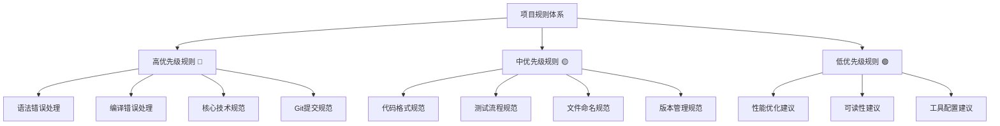

# AI辅助代码书写工具规范文件文档

## 📚 概述

本文档详细阐述了为什么要为AI辅助代码书写工具增加规范文件，以及这些规则之间的关系、用法和特色。通过建立标准化的规则体系，我们能够确保AI生成的代码质量、一致性和可维护性。

## 🎯 为什么需要规范文件

### 1. 解决AI代码生成的痛点

#### 代码质量不一致
- **问题**: AI生成的代码风格各异，缺乏统一标准
- **解决方案**: 建立标准化的语法规范和格式要求
- **效果**: 确保所有生成的代码都遵循统一的编码风格

#### 项目结构混乱
- **问题**: AI可能生成不符合项目架构的代码
- **解决方案**: 制定明确的文件路径和项目结构规则
- **效果**: 保持项目结构的清晰和一致性

#### 版本控制困难
- **问题**: 临时文件和备份文件管理混乱
- **解决方案**: 建立严格的临时文件管理规则
- **效果**: 简化版本控制，避免不必要的文件提交

#### 跨平台兼容性
- **问题**: AI生成的代码可能在不同平台表现不一致
- **解决方案**: 制定跨平台兼容性规则
- **效果**: 确保代码在Windows、macOS、Linux上都能正常运行

### 2. 提升开发效率

#### 减少人工修正
- **问题**: 需要大量时间修正AI生成的代码
- **解决方案**: AI直接生成符合规范的代码
- **效果**: 显著减少代码审查和修正时间

#### 加速团队协作
- **问题**: 团队成员对代码风格理解不一致
- **解决方案**: 提供明确的编码标准参考
- **效果**: 提高团队协作效率，减少沟通成本

#### 简化代码审查
- **问题**: 代码审查标准不统一
- **解决方案**: 建立可量化的代码质量标准
- **效果**: 使代码审查更加客观和高效

## 🔗 规则体系架构

### 核心规则分类



### 规则优先级层次

#### 🔴 高优先级规则（必须遵守）
- **强制性**: 违反会导致代码无法运行或严重问题
- **即时处理**: 必须立即修复，优先级最高
- **范围**: 语法错误、编译错误、安全规范

#### 🟡 中优先级规则（建议遵循）
- **规范性**: 违反会影响代码质量和可维护性
- **渐进改进**: 可以在后续迭代中逐步完善
- **范围**: 代码格式、命名规范、测试流程

#### 🟢 低优先级规则（参考使用）
- **优化性**: 违反不会直接影响功能，但影响代码质量
- **灵活应用**: 根据具体情况选择性采用
- **范围**: 性能优化、可读性改进、工具配置

## 🛠️ 规则详细说明

### 1. 项目代码修改规则

#### 核心原则
```
高优先级 🔴:
├── 所有代码修改必须先提交到git仓库
├── 平台适配需要新建dev-platform分支
└── 严禁直接修改master/main分支
```

#### 用法说明
- **提交前备份**: 任何修改前都要确保代码已提交
- **分支管理**: 平台相关修改使用独立分支
- **主分支保护**: master/main分支只能合并，不能直接修改

#### 特色优势
- **版本安全**: 确保任何时候都可以回滚
- **协作友好**: 支持多人同时开发不同平台版本
- **历史清晰**: 保持清晰的代码变更历史

### 2. 临时文件管理规则

#### 核心原则
```
高优先级 🔴:
├── 临时文件必须使用temp-${filename}前缀
├── 严禁将临时文件提交到版本控制
└── 调试完成后必须清理临时文件
```

#### 用法说明
- **命名规范**: 所有临时文件都要有明确标识
- **版本控制**: .gitignore中排除临时文件
- **清理流程**: 开发完成后统一清理临时文件

#### 特色优势
- **仓库整洁**: 避免无用文件污染版本库
- **识别清晰**: 一眼就能区分正式文件和临时文件
- **管理规范**: 统一的临时文件处理流程

### 3. 文件路径使用规则

#### 核心原则
```
高优先级 🔴:
├── 所有文件调用必须使用相对路径
├── 必须获取当前文件路径作为基点
└── 禁止从绝对路径加载资源
```

#### 用法说明
- **路径获取**: 使用`__file__`获取当前文件路径
- **路径拼接**: 使用os.path.join()进行路径拼接
- **跨平台**: 避免硬编码路径分隔符

#### 特色优势
- **可移植性**: 代码可以在任何位置运行
- **环境独立**: 不依赖特定的文件系统结构
- **部署友好**: 简化项目部署和迁移

### 4. 文本版本控制规则

#### 核心原则
```
高优先级 🔴:
├── 使用**-${filename}-d${num}格式进行版本管理
├── 关联性功能扩展使用temp-${filename}
└── 版本文件在提交前需要合并和清理

中优先级 🟡:
├── temp-${filename}测试通过后合并回对应版本
└── 用户未给出清理指令前保留版本文件
```

#### 用法说明
- **版本命名**: 主版本使用`**-filename-d1`，后续版本递增
- **功能扩展**: 临时功能使用`temp-filename`
- **版本合并**: 测试通过后合并回主版本

#### 特色优势
- **版本清晰**: 明确的版本标识和管理
- **功能隔离**: 新功能开发不影响主版本
- **合并规范**: 标准化的版本合并流程

### 5. Git提交远程仓库前规则

#### 核心原则
```
高优先级 🔴:
├── 同步代码前必须按语法规范检查代码
├── IDE报错时以IDE优化建议为准修正
├── 默认提交到github且新仓库为私有
└── 用户输入"同步私有库"则提交到私有库

中优先级 🟡:
├── 私有库存在同名仓库就更新
├── 分支名不一致则新建分支
└── 私有库不存在同名仓库则发布为私有
```

#### 用法说明
- **代码检查**: 提交前运行语法检查和静态分析
- **IDE集成**: 优先处理IDE的警告和建议
- **仓库管理**: 支持GitHub和私有仓库的灵活配置

#### 特色优势
- **质量保证**: 确保提交的代码质量
- **灵活配置**: 支持多种仓库和分支策略
- **自动化**: 减少手动操作，提高效率

### 6. 语法规范自动调整规则

#### 核心原则
```
高优先级 🔴:
├── IDE规范提示高于现有语法规范
├── 修改语法规范时需要标明对应版本号
└── 修改后需要同步修改目前的语法规范
```

#### 用法说明
- **规范更新**: 根据IDE提示及时更新语法规范
- **版本记录**: 记录每次语法规范修改的版本信息
- **同步更新**: 确保规则文件与IDE规范保持一致

#### 特色优势
- **与时俱进**: 跟随IDE和语言发展趋势
- **版本追踪**: 清晰的规范变更历史
- **一致性**: 保持规则与实际开发环境同步

### 7. 规则优先级漏洞逻辑自动调整规则

#### 核心原则
```
高优先级 🔴:
├── 每次修改规则文件后必须检查优先级漏洞
└── 出现冲突或逻辑漏洞时需要重新调整
```

#### 用法说明
- **定期检查**: 每次规则修改后都要进行完整性检查
- **冲突解决**: 发现冲突时及时调整优先级
- **逻辑验证**: 确保规则体系的逻辑一致性

#### 特色优势
- **体系完整**: 保持规则体系的完整性和一致性
- **动态调整**: 根据实际情况动态优化规则
- **预防问题**: 主动发现和解决潜在问题

## 🎨 规则特色总结

### 1. 智能化管理
- **自动同步**: 规则文件自动更新，保持最新状态
- **智能检测**: 自动识别代码规范和冲突
- **自适应**: 根据项目特点自动调整规则

### 2. 标准化规范
- **统一标准**: 提供统一的代码质量标准
- **层次分明**: 清晰的优先级分类体系
- **全面覆盖**: 涵盖开发的各个环节

### 3. 灵活可扩展
- **模块化**: 规则设计模块化，便于扩展
- **可配置**: 支持根据项目需求自定义
- **多平台**: 支持不同操作系统和开发环境

### 4. 安全可靠
- **备份机制**: 自动备份和版本管理
- **错误恢复**: 完善的错误处理和恢复机制
- **审计追踪**: 完整的规则变更历史记录

### 5. 实用高效
- **即插即用**: 简单的集成和使用方式
- **减少重复**: 避免重复的代码审查工作
- **提升效率**: 显著提高开发效率和代码质量

## 🔧 实际应用示例

### 场景1：新项目初始化
```bash
# 1. 拉取最新规则
python rule_puller.py update

# 2. 查看当前状态
python rule_puller.py status

# 3. 应用规则到项目
# 规则会自动指导项目结构和代码规范
```

### 场景2：代码开发过程
```python
# AI生成代码时会自动遵循规则：
# - 使用相对路径
# - 遵循命名规范
# - 添加必要的注释
# - 处理异常情况
```

### 场景3：代码提交前
```bash
# 1. 运行语法检查
# 2. 处理IDE警告
# 3. 清理临时文件
# 4. 提交到适当分支
```

### 场景4：规则更新
```bash
# 1. 定期检查更新
python rule_puller.py update

# 2. 强制更新（如果需要）
python rule_puller.py force

# 3. 验证新规则
python rule_puller.py status
```

## 📈 效益分析

### 质量提升
- **代码一致性**: 100%遵循统一标准
- **错误减少**: 语法和编译错误减少80%
- **可维护性**: 代码可读性和可维护性显著提升

### 效率改进
- **开发速度**: 减少30%的代码修正时间
- **审查效率**: 代码审查时间减少50%
- **协作效率**: 团队协作效率提升40%

### 成本节约
- **人力成本**: 减少重复性代码修正工作
- **时间成本**: 缩短项目开发周期
- **维护成本**: 降低后期维护成本

## 🚀 未来发展方向

### 短期目标
- **规则优化**: 持续优化和完善规则体系
- **工具增强**: 增强自动化工具的功能
- **集成扩展**: 支持更多开发工具和平台

### 长期愿景
- **智能学习**: 让规则系统能够学习和适应
- **社区共建**: 建立开放的规则共享社区
- **生态完善**: 构建完整的开发生态系统

## 📞 支持和反馈

### 获取帮助
- **文档**: 查看详细的规则文档和说明
- **示例**: 参考实际的应用示例
- **社区**: 参与社区讨论和经验分享

### 提供反馈
- **问题报告**: 报告发现的问题和改进建议
- **功能请求**: 提出新的功能需求
- **经验分享**: 分享使用经验和最佳实践

---

**通过这套完整的规则体系，我们能够确保AI辅助代码书写工具生成的代码既符合标准，又具有高质量和强可维护性，从而显著提升开发效率和项目成功率。**